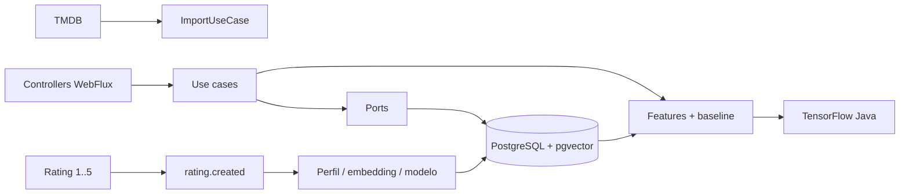

# Movie Recommendation

API reativa e multiusuário para importar filmes e séries do TMDB, registrar preferências explícitas e recomendar o que assistir individualmente ou em grupo. O projeto preserva conteúdos antigos sem `tmdb_id` e identifica imports pela chave lógica `(tmdb_id, type)`.

## Arquitetura e stack



- Java 21, Kotlin e Spring Boot 4.1.1
- Spring WebFlux + Kotlin Coroutines, sem `block()` nos fluxos reativos
- Spring Data R2DBC para a aplicação; JDBC é usado somente pelo Flyway na inicialização
- PostgreSQL 16 + pgvector
- TensorFlow Java 1.1.0 (última linha com binário Windows x86-64)
- Kafka 4.1, Gradle Kotlin DSL, Docker Compose e Testcontainers

O fluxo principal segue `Controller → Use Case → Port → Adapter`. DTOs do TMDB são convertidos por mappers antes de persistir modelos internos.

## Pré-requisitos

- JDK 21
- Docker Desktop (Linux containers)
- PowerShell no Windows 11
- Token de leitura da [API do TMDB](https://developer.themoviedb.org/docs/getting-started)

Copie `.env.example` para `.env` ou exporte as variáveis no shell. Nunca versione o valor real do token.

| Variável | Obrigatória | Padrão/uso |
|---|---:|---|
| `TMDB_READ_ACCESS_TOKEN` | Para endpoints TMDB | Sem padrão; a API retorna erro de configuração sem ela |
| `DB_PASSWORD` | Não, em dev | `postgres` |
| `DB_USERNAME` | Não | `postgres` |
| `DB_R2DBC_URL` | Não | `r2dbc:postgresql://localhost:5432/movie_recommendation` |
| `DB_JDBC_URL` | Não | URL JDBC equivalente, usada pelo Flyway |
| `KAFKA_ENABLED` | Não | `false`; use `true` com o container Kafka ativo |
| `KAFKA_BOOTSTRAP_SERVERS` | Não | `localhost:9092` |
| `MODEL_DIRECTORY` | Não | `./data/models` |

No PowerShell:

```powershell
$env:TMDB_READ_ACCESS_TOKEN = "seu-token"
$env:DB_PASSWORD = "postgres"
$env:KAFKA_ENABLED = "true"
docker compose up -d
.\gradlew.bat bootRun
```

A API inicia em `http://localhost:8080`. Para encerrar a infraestrutura, use `docker compose down`. O volume `postgres_data` é preservado; não use `down -v` se quiser manter os dados.

## Banco e migrations

Flyway executa `src/main/resources/db/migration`. O baseline é conscientemente configurado como versão `0`: em um schema antigo não vazio ele cria a tabela de histórico e aplica migrations aditivas; em banco novo cria todo o schema. Não há `DROP TABLE`.

As migrations incluem catálogo, usuários, ratings, relações, extensão `vector`, embeddings de dimensão 8 e outbox reservado para evolução da entrega transacional. A imagem Docker já contém pgvector.

## Endpoints principais

### Conteúdo e TMDB

| Método | Caminho | Função |
|---|---|---|
| `GET` | `/contents` | Lista conteúdo |
| `GET` | `/contents/{id}` | Busca por ID local |
| `POST` | `/contents` | Cria (`201`) |
| `PUT` | `/contents/{id}` | Atualiza |
| `DELETE` | `/contents/{id}` | Remove (`204`) |
| `GET` | `/contents/search?title=Matrix` | Busca filme no TMDB |
| `GET` | `/contents/tmdb/{tmdbId}/details` | Detalhes externos de filme |
| `GET` | `/contents/tmdb/{tmdbId}/credits` | Créditos externos de filme |
| `POST` | `/contents/tmdb/{tmdbId}/import` | Importa/atualiza filme |
| `POST` | `/contents/tmdb/series/{tmdbId}/import` | Importa/atualiza série |

Filmes usam details + credits; séries usam `/tv/{id}` + `/tv/{id}/aggregate_credits`. A regra de aplicação ordena o cast por `order` e persiste somente os dez atores principais. `content_director` guarda diretores para filmes e creators para séries. Imports usam transação R2DBC e UPSERT, atualizam campos mutáveis e relações e preservam o ID local.

### Usuários e ratings

| Método | Caminho |
|---|---|
| `GET/POST` | `/users` |
| `GET/PUT/DELETE` | `/users/{id}` |
| `GET` | `/users/{userId}/ratings` |
| `POST/PUT` | `/users/{userId}/ratings` |
| `DELETE` | `/users/{userId}/ratings/{ratingId}` |

Exemplo:

```json
{
  "targetType": "ACTOR",
  "targetId": 42,
  "value": 5
}
```

`targetType` aceita `MOVIE`, `SERIES`, `ACTOR`, `DIRECTOR`, `CREATOR` ou `GENRE`. A mesma pessoa pode ter notas distintas em cada papel. Há unicidade no banco por usuário, papel e alvo. A normalização vive em um único componente e aplica `(value - 1) / (5 - 1)`: `1→0`, `2→0.25`, `3→0.5`, `4→0.75`, `5→1`.

### Recomendações

| Método | Caminho | Função |
|---|---|---|
| `GET` | `/recommendations/users/{userId}?limit=20` | Recomendação individual |
| `POST` | `/recommendations/users/{userId}/train` | Treino explícito do modelo |
| `POST` | `/recommendations/joint` | Recomendação conjunta |

Corpo da recomendação conjunta:

```json
{ "userIds": [1, 2], "limit": 20 }
```

Conteúdos já avaliados são removidos. Cada resposta traz conteúdo, score `0..1`, estratégia e motivos explicáveis.

## Features, baseline e TensorFlow

Cada exemplo representa `User + Content`. As oito features, todas em `0..1`, são:

1. afinidade com gêneros do conteúdo;
2. afinidade com os dez atores principais;
3. afinidade com diretor (filme) ou creator (série);
4. média de ratings diretos de filmes;
5. média de ratings diretos de séries;
6. média do histórico direto;
7. popularidade normalizada entre usuários;
8. similaridade do embedding pgvector.

O label é o rating direto normalizado do conteúdo. Ao construir uma linha, o próprio rating-label é removido do histórico para evitar vazamento. O split treino/validação e a inicialização usam seed `42`.

O baseline usa pesos configuráveis em `application.properties`: gênero `0.30`, ator `0.20`, diretor/creator `0.20`, filme `0.15` e série `0.15`. Sem ratings, combina baseline neutro e popularidade; com poucos ratings, usa baseline + pgvector. A partir de oito ratings diretos, treina regressão logística no grafo do TensorFlow com gradient descent, registra loss de treino/validação e persiste pesos por usuário em `MODEL_DIRECTORY`.

Embeddings de conteúdo são vetores determinísticos normalizados derivados de tipo, gêneros, atores e diretor/creator. O embedding do usuário é a média ponderada dos conteúdos avaliados. pgvector calcula similaridade cosseno e entra como sinal complementar, não substitui o recommender.

Na recomendação conjunta, primeiro se obtém o score individual. A agregação usa 70% de média harmônica e 30% do menor score, reduzindo opções excelentes para uma pessoa e ruins para outra.

## Kafka

Ao criar ou alterar rating, o producer publica `rating.created`, particionado por `userId`. O consumer atualiza embeddings e, havendo amostras suficientes, retreina o modelo daquele usuário. Tudo continua em um monólito modular. Kafka é opcional para desenvolvimento (`KAFKA_ENABLED=false`); o rating continua funcional e o perfil também é atualizado sob demanda ao recomendar.

## Testes e build

```powershell
.\gradlew.bat clean test
.\gradlew.bat build
```

Em Linux/macOS, use `./gradlew`. A suíte contém testes unitários de normalização, mappers, imports, ratings, features, dataset, baseline, TensorFlow e recomendação conjunta; testes WebFlux de controllers; MockWebServer para TMDB; e Testcontainers para PostgreSQL/pgvector e Kafka. Testes de container se auto-ignoram somente quando não existe um daemon Docker acessível.

O primeiro build baixa os binários nativos do TensorFlow e pode demorar. No Windows, o Gradle direciona a extração nativa dos testes para `build/tensorflow-native`.
