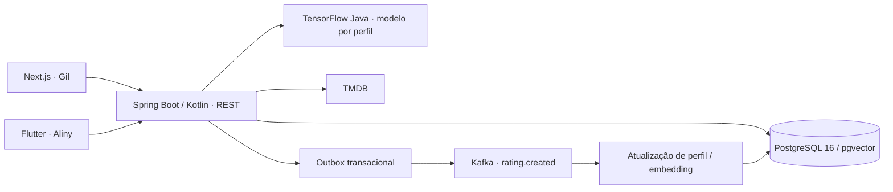

# LUME · Movie Recommendation

Um próximo favorito para cada gosto. Gil usa a Web; Aliny usa o Android. Cada perfil mantém suas avaliações e seu próprio modelo. Em **Para nós**, o backend combina as afinidades dos participantes sem criar um terceiro modelo.

O produto inclui seleção/criação de perfil, busca de filmes, séries, pessoas e gêneros, importação TMDB, avaliações com autosave, avaliação rápida, histórico, preferências de gênero, acompanhamento/treinamento do modelo e recomendações individuais e conjuntas.

**Comece pelo [runbook para Windows 11](docs/RUNBOOK.md).** Resultados executados: [docs/VALIDATION.md](docs/VALIDATION.md).

## Arquitetura



| Parte | Implementação |
|---|---|
| Backend na raiz | Java 21, Kotlin, Spring Boot 4.1.1, WebFlux, Coroutines, R2DBC, Flyway, Gradle Kotlin DSL |
| Machine learning | TensorFlow Java **1.1.0**, mantendo o binário Windows x86-64 existente |
| Infraestrutura | PostgreSQL 16 + pgvector, broker Kafka 4.1, Docker Compose |
| `web/` | Next.js 16.3.4, TypeScript, App Router, Tailwind, TanStack Query |
| `mobile/` | Flutter 3.47.2 / Dart, Material 3, Riverpod, Dio, go_router |
| `scripts/` | Inicialização, parada e builds em PowerShell |

Toda regra de rating, normalização, features e recomendação fica no backend. Os clientes recebem scores e notas normalizadas da API. O token TMDB fica exclusivamente no servidor.

## Perfis e experiência

A primeira tela pergunta **Quem está avaliando?**. A migration adiciona Gil e Aliny apenas quando esses nomes ainda não existem. Outros perfis podem ser criados pela interface. A seleção persiste localmente e o perfil ativo permanece visível. Os clientes usam os IDs retornados pela API, inclusive para The Matrix e outros imports.

A identidade LUME usa preto e roxo, navegação simples, posters sob demanda, cache, skeletons, alvos de toque grandes e estrelas com nomes acessíveis. Web e mobile oferecem Início, Busca, Avaliação de conteúdo/pessoa, Seus gostos, Avaliação rápida, Minhas avaliações, Meu modelo, Para você, Para nós e Configurações.

Nesta fase, os perfis são uma conveniência para duas pessoas numa rede confiável. Não há autenticação: quem alcança a API pode selecionar qualquer perfil. Uma publicação pública exige controle de acesso, além de HTTPS.

## Busca e catálogo

`GET /discovery/search?q=...` pesquisa o banco primeiro. Resultados locais aparecem como **No catálogo**. Se não houver, o backend consulta o TMDB e os clientes oferecem **Importar e avaliar**. Filtros: MOVIE, SERIES, PERSON e GENRE. A busca possui debounce, cancelamento e cache nos clientes.

Imports de filmes/séries permanecem idempotentes por `(tmdb_id, type)`. Conteúdos antigos sem `tmdb_id` continuam disponíveis. Pessoas podem ter notas distintas como ACTOR, DIRECTOR e CREATOR. Direção exige crédito de Director; criação exige relação real de criação de série. Writer não é convertido em Creator. A tela da pessoa permite atualizar foto e papéis comprovados pelo TMDB.

A tela de conteúdo reúne sua nota, gêneros, os dez atores persistidos, direção e creators numa resposta consolidada. Falhas externas têm mensagens compreensíveis e não impedem o uso do catálogo local.

## Avaliações e normalização

Todas as seis categorias usam notas de 1 a 5. A única implementação de normalização é `RatingNormalizer` no backend:

| Nota | Significado | `(value - 1) / 4` |
|---|---|---|
| 1 | Não gosto | 0,00 |
| 2 | Gosto pouco | 0,25 |
| 3 | Neutro | 0,50 |
| 4 | Gosto | 0,75 |
| 5 | Gosto muito | 1,00 |

Ausência de nota é `null`; valores fora da escala retornam HTTP 400. Um toque muda a estrela imediatamente, agrupa alterações rápidas e salva. Em falha, a escolha permanece localmente com **Tentar novamente**. O endpoint batch parcial é transacional e reutiliza as mesmas regras.

Na avaliação rápida, filmes e séries alternam com diversidade de gêneros. Conteúdos já avaliados pelo perfil são excluídos. **Não assisti** apenas pula; nunca cria nota. Populares dependem da configuração TMDB.

## TensorFlow: 8, 25 e retreino

| Ratings diretos MOVIE/SERIES | Experiência |
|---|---|
| 0–7 | COLLECTING_DATA; completar 8 para liberar treinamento |
| 8–24 | Treino experimental disponível; progresso para 25 |
| 25+ | Base inicial recomendada atingida |

ACTOR, DIRECTOR, CREATOR e GENRE alimentam features; nunca aumentam essa contagem. O treinamento mantém oito features em 0..1, separa treino/validação com seed 42 antes de construir o dataset e exclui o próprio label e os labels de validação das features de treino.

TensorFlow Java executa treinamento real. Pesos e métricas ficam em arquivos versionados por usuário e em metadados no PostgreSQL. A tela mostra train loss, validation loss, datas, versão, amostras usadas e avaliações novas. Um lock no banco impede treinos simultâneos do mesmo perfil.

Após o primeiro treino, alterar preferências marca o modelo DIRTY. Com auto-treino habilitado, **dez novos ratings diretos** disparam retreino no verificador periódico. Editar repetidamente uma mesma nota não conta como dez novos ratings. Não há treinamento completo por clique nem por leitura de recomendações. Estados: COLLECTING_DATA, READY, TRAINING, TRAINED, DIRTY e ERROR. Veja [o desenho do modelo](docs/MODEL.md).

## pgvector e Kafka

Embeddings permanecem `vector(8)`. Salvar preferências recalcula o vetor do perfil; similaridade cosseno é um sinal complementar ao TensorFlow. Preferências neutras não deixam um vetor antigo ativo.

Com Kafka habilitado, a mesma transação do rating registra um evento na outbox. O publicador envia `rating.created` com chave `userId`, registra confirmação e tenta novamente quando necessário. O consumer atualiza perfil/embedding sem criar outro rating. O processamento tolera entrega repetida. Com `KAFKA_ENABLED=false`, persistência, perfil e recomendações continuam funcionando.

## Recomendações

**Para você** exclui conteúdos já avaliados e mostra score, estratégia e motivos. Antes do treino, usa o baseline/cold start existente; depois usa os pesos individuais aprendidos pelo TensorFlow.

**Para nós** calcula, no backend, **70% da média harmônica + 30% do menor score**, excluindo títulos avaliados por qualquer participante. Scores individuais também ficam disponíveis. O percentual representa afinidade, não uma probabilidade calibrada.

## Configuração e início

No diretório existente:

```powershell
cd C:\dev\workspace\movie-recommendation
if (-not (Test-Path .env)) { Copy-Item .env.example .env }
notepad .env
# Preencha TMDB_READ_ACCESS_TOKEN somente no .env do backend.
powershell -NoProfile -ExecutionPolicy Bypass -File scripts/start-local.ps1 -LanWeb
```

Gil abre **http://localhost:3000**. O script imprime as URLs da API e Web na rede. Aliny usa um APK compilado para esse mesmo IPv4:

```powershell
powershell -NoProfile -ExecutionPolicy Bypass -File scripts/build-android.ps1 -ApiBaseUrl http://IP_DO_PC:8080
```

O APK fica em `mobile/build/app/outputs/flutter-apk/app-release.apk`. Instalação, assinatura, ADB, firewall, builds manuais e iOS estão no [runbook](docs/RUNBOOK.md). A URL Web é `NEXT_PUBLIC_API_BASE_URL`; a do Flutter é `--dart-define=API_BASE_URL=...`.

## Banco, testes e build

Flyway preserva as migrations anteriores e adiciona `V3__profiles_discovery_and_model_state.sql`: perfis ausentes, papéis de pessoa, ordem de elenco, índices e estado/amostras do modelo. Dados legados e IDs permanecem válidos. Preserve o volume PostgreSQL e `data/models` nos backups; não recrie o schema para atualizar.

Com Docker ativo e toolchains disponíveis:

```powershell
powershell -NoProfile -ExecutionPolicy Bypass -File scripts/build-all.ps1 -ApiBaseUrl http://IP_DO_PC:8080 -AppBundle
```

Esse comando falha na primeira etapa com erro: backend clean/test/build, Web install/lint/test/build, Flutter pub/analyze/test/APK e, opcionalmente, AAB. Integrações usam containers isolados, sem modificar o histórico real. Com Docker indisponível, o JUnit pode marcar integrações como skipped; isso não é validação completa.

Consulte [API](docs/API.md), [modelo](docs/MODEL.md), [Web](web/README.md), [mobile](mobile/README.md), [execução e troubleshooting](docs/RUNBOOK.md) e [evidências da entrega](docs/VALIDATION.md).
